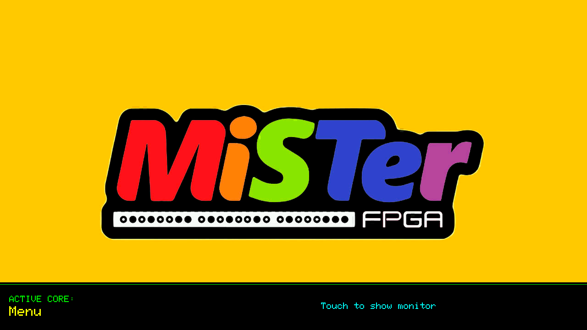
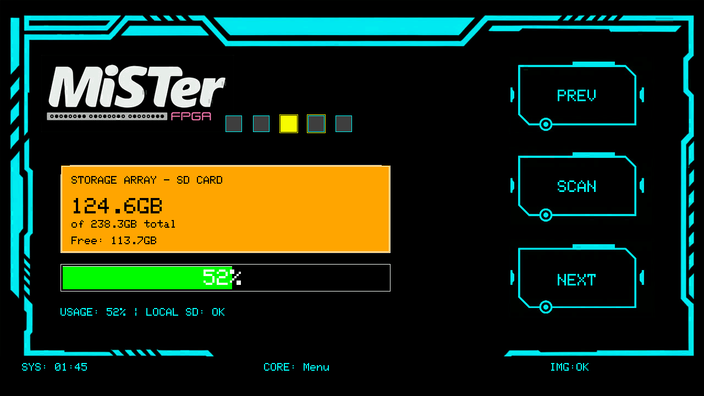
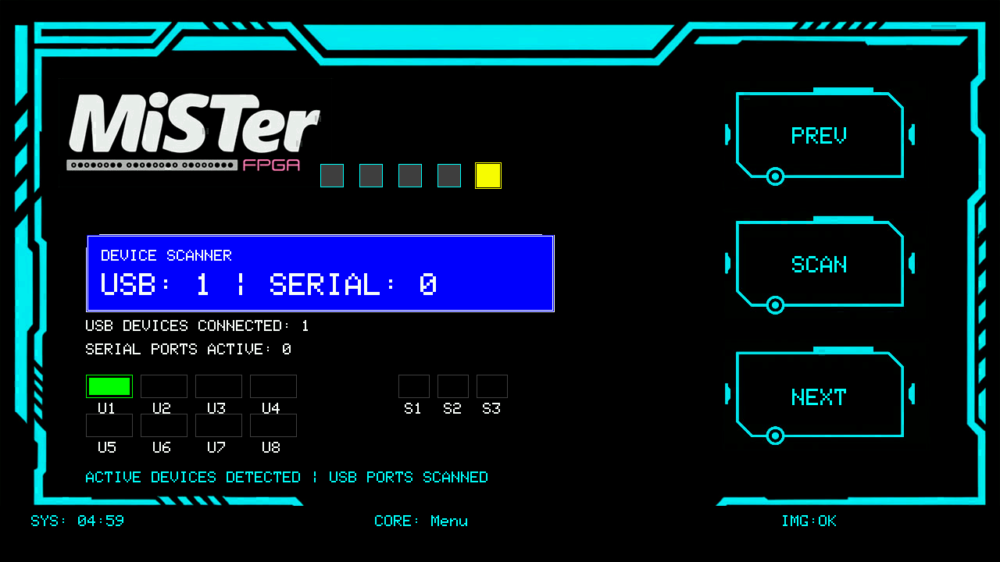
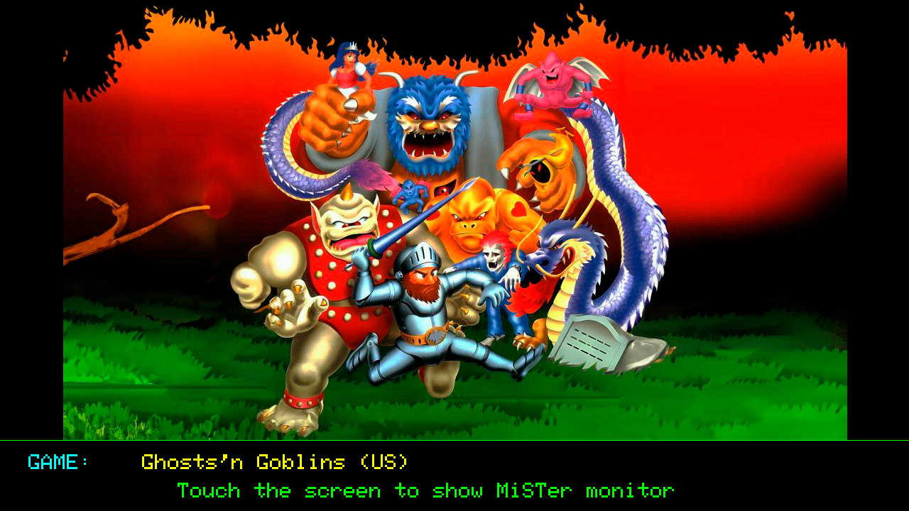
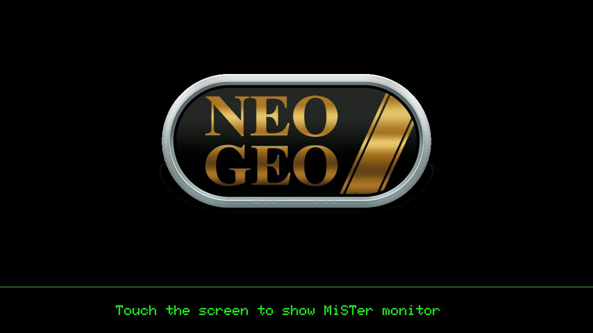
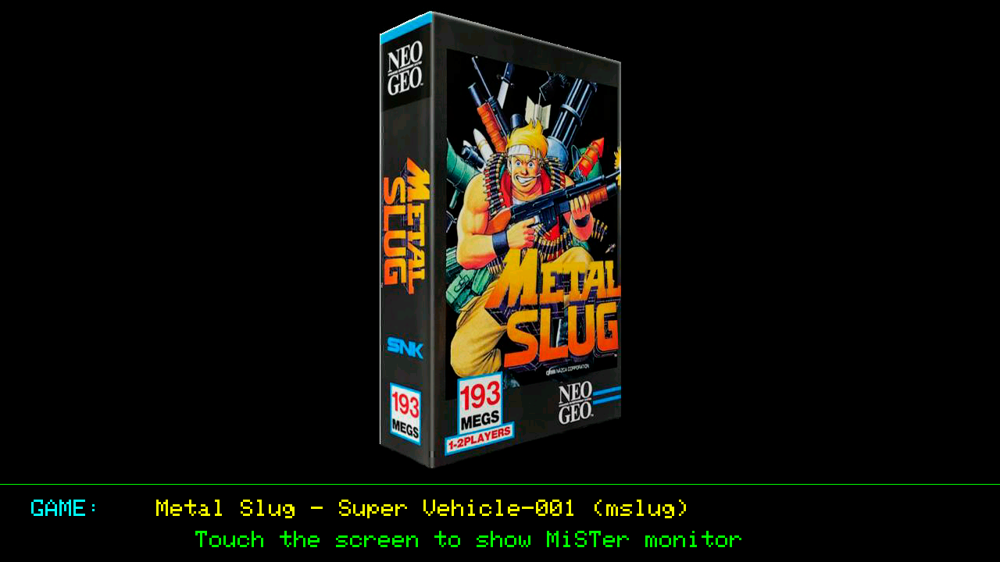

# MiSTer FPGA Monitor for M5Stack Tab5

A status monitor for the MiSTer FPGA platform, running on an
Tab5 ESP32 device from M5Stack. Displays the currently loaded game artwork, system
information, storage status, and network details in real time.

## Features

- Real-time game and core artwork display via ScreenScraper API
- Automatic game and system detection from OSD, MiSTer Remote web app and Super Attract Mode (SAM)
- Automatic Arcade subsystem detection
- System monitor (CPU, memory, uptime, storage, network, and connected USB devices panels)
- Touch-based navigation
- Screenshot capture of the Tab5 display, downloadable over the local network via HTTP

## Hardware Requirements

- M5Stack Tab5 (ESP32-P4, 1280×720 display)
- MiSTer FPGA with network connectivity
- microSD card for the Tab5 (image storage)

## Software Requirements

- Arduino IDE with M5Unified and M5GFX libraries
- Python 3 on the MiSTer (included in MiSTer Linux)
- ScreenScraper dev account (free) at screenscraper.fr

## Installation

### MiSTer Side

1. Copy `mister/mister_status_server.py` to `/media/fat/Scripts/mister_monitor/`
2. Copy `mister/detect_game_load.sh` to `/media/fat/Scripts/mister_monitor/`
3. Copy `mister/start_monitor.sh` to `/media/fat/Scripts/mister_monitor/`
4. Make the shell scripts executable:
```bash
   chmod +x /media/fat/Scripts/mister_monitor/detect_game_load.sh
   chmod +x /media/fat/Scripts/mister_monitor/start_monitor.sh
```
5. Add the following lines to `/media/fat/linux/user-startup.sh` to launch
   both scripts automatically on boot:
```bash
   python3 /media/fat/Scripts/mister_monitor/mister_status_server.py &
   bash /media/fat/Scripts/mister_monitor/detect_game_load.sh &
```

#### Screenshot HTTP Server

The Tab5 can capture screenshots of its own display and make them available
for download over the local network. The `mister_status_server.py` script
includes a lightweight HTTP endpoint for this purpose.

Once the server is running on the MiSTer, any screenshot is accessible from a
browser or `curl` on the same network. To download the latest screenshot, open:

```
http://<Tab5-IP>:8080/screenshot.jpg
```

Replace `<Tab5-IP>` with the IP address shown in the Tab5 Network Terminal
panel. No extra software is required on the MiSTer side — the endpoint is
served directly by `mister_status_server.py`.

### Tab5 Side

#### Installing M5Stack Board Support in Arduino IDE

Before opening the sketch you need to download the M5Stack board package
with Arduino IDE so the Tab5 target appears in the board selector.

1. Open Arduino IDE and go to **File → Preferences**.
2. In the **Additional boards manager URLs** field, add the following URL
   (click the icon to the right of the field if you need to add it to an
   existing list):
   ```
   https://static-cdn.m5stack.com/resource/arduino/package_m5stack_index.json
   ```
3. Click **OK** to close Preferences.
4. Go to **Tools → Board → Boards Manager…**
5. Search for **M5Stack** and install the package named **M5Stack by M5Stack**.
   The installation may take a few minutes as it downloads the ESP32 toolchain.
6. Once installed, go to **Tools → Board → M5Stack** and select **M5Tab5**.
7. Connect the Tab5 via USB-C, select the correct port under **Tools → Port**,
   and you are ready to upload.

#### Uploading the Sketch

No credentials need to be hardcoded in the source. All configuration is read
at boot from `config.ini` on the microSD card (see the SD Card Setup section
below).

1. Open `mister_monitor_Tab5/mister_monitor_Tab5.ino` in Arduino IDE.
2. Install required libraries via **Tools → Manage Libraries…**:
   - M5Unified
   - M5GFX
   - JPEGDEC
3. Select the M5Stack Tab5 board and upload.

### Tab5 SD Card Setup

#### config.ini

All user configuration lives in a single file placed in the **root** of the
microSD card: `/config.ini`. The sketch reads it at boot before connecting to
WiFi, so no credentials ever need to be hardcoded in the source.

Copy `config.ini` from the repository root to the SD card and fill in your
values:

```ini
[wifi]
ssid=YOUR_WIFI_SSID
password=YOUR_WIFI_PASSWORD

[mister]
ip=192.168.1.100          ; must be a static IP — see note below

[screenscraper]
ss_user=YOUR_SS_USERNAME
ss_pass=YOUR_SS_PASSWORD
ss_dev_user=YOUR_SS_USERNAME
ss_dev_pass=YOUR_SS_DEV_PASSWORD
```

Any key that is absent keeps the built-in default. The full list of available
keys is documented inside `config.ini` itself with comments explaining each
option.

**Static MiSTer IP address** — the Tab5 connects to the MiSTer by IP, so a
static address is required. Edit `/etc/dhcpcd.conf` on the MiSTer and add:

```
interface eth0
static ip_address=192.168.0.XX/24
static routers=192.168.0.X
static domain_name_servers=192.168.0.X 8.8.8.8
```

Use `interface wlan0` instead of `eth0` for a wireless connection. The `/24`
netmask covers the most common home network setup; adjust if your router uses
a different subnet.

#### Artwork download order

The sketch downloads artwork from ScreenScraper for each core and game it
encounters. You can control which image types are tried and in what order via
keys in the `[images]` section of `config.ini`:

| Key | Used for |
|---|---|
| `core_media_order` | System-level art (non-arcade cores) |
| `arcade_subsystem_media_order` | Arcade subsystem art (CPS2, Capcom Classics…) |
| `arcade_media_order` | Arcade game artwork |
| `game_media_order` | Non-arcade game artwork (consoles, computers) |

Each value is a comma-separated list of tokens tried left to right until one
download succeeds. Available tokens:

| Token | Description |
|---|---|
| `wheel-steel` | Steel/metallic border logo wheel |
| `wheel-carbon` | Carbon fibre border logo wheel |
| `wheel` | Plain/transparent border logo wheel |
| `box3d` | 3-D rendered box art |
| `box2d` | 2-D flat box scan |
| `fanart`
| `marquee` | Arcade cabinet marquee header |
| `screenshot` | In-game title screenshot |
| `photo` | Real photograph of hardware |
| `illustration` | Illustration of hardware |
| `mix` | MixRBV composite image |

Region order within each token — the region= key in [screenscraper]
controls which regional variant is tried first. The remaining regions follow
in fixed order, and the no-region generic variant is tried last. For example,
with region=eu and token box3d the sequence is:
box-3D(eu) → box-3D(wor) → box-3D(us) → box-3D(jp) → box-3D.


Default orders applied out of the box:

```ini
; System/core artwork: steel wheel first (cleanest on the HUD background)
core_media_order=wheel-steel,wheel-carbon,wheel,photo,illustration,box3d,box2d,marquee,fanart,screenshot

; Arcade subsystems (CPS1, SEGA Classics, ...): wheels only
arcade_subsystem_media_order=wheel-steel,wheel-carbon,wheel

; Arcade game ROMs: logo art before boxes (most titles have no physical box)
arcade_media_order=fanart,marquee,wheel-carbon,wheel-steel,wheel,box3d,box2d,screenshot

; Non-arcade game ROMs: physical box art first
game_media_order=box3d,box2d,wheel-carbon,wheel-steel,wheel,fanart,marquee,screenshot
```

#### Asset Images

The repository includes a set of needed images in the
`assets/` folder. Copy them to the microSD card as follows:

- `frame01.jpg`, `frame02.jpg`, `logomister.jpg` and `menu.jpg` must be placed inside
  the `/cores/` folder.
- `Arcade.jpg` and `Arcade_75.jpg` must be placed inside `/cores/A/`.

Core and game images that are missing will be downloaded automatically from
ScreenScraper the first time that core/game is detected.

## Getting a ScreenScraper Developer Account

The ScreenScraper API requires a **developer account** in addition to a
regular user account. The process has two steps:

### 1. Create a regular user account

Register for free at [https://www.screenscraper.fr](https://www.screenscraper.fr).
Take note of your username and password — you will enter them in the sketch.

### 2. Request a developer account

Developer accounts are granted manually by the ScreenScraper team via their
forum. Once logged in:

1. Go to [https://www.screenscraper.fr/forum.php](https://www.screenscraper.fr/forum.php).
2. Find the thread titled **"ScreenScraper WebAPI"**.
3. Post a reply in that thread requesting a developer account. In your
   message, briefly explain what you intend to build with the API — for
   example: *"I want to use an open-source game artwork monitor for the
   MiSTer FPGA platform running on an ESP32-based display."*
4. The team will review your request and enable the developer role on your
   account, typically within a few days.

Once your developer account is active, you will receive a response in the forum
with confirmation and instructions for its use. Enter your credentials in
`config.ini` under the `[screenscraper]` section.

## Architecture

The system has three components that work together:

- **`mister_status_server.py`** — HTTP server on port 8080. Reads MiSTer state
  files from `/tmp/` and exposes them as JSON/text endpoints.
- **`detect_game_load.sh`** — Shell script that monitors filesystem events to
  distinguish a real game load from cursor navigation in the OSD menu.
- **Tab5 sketch** — Polls the server every few seconds, downloads artwork from
  ScreenScraper, and renders the HUD interface.

## Screenshots












## To Do

- **M5Stack Core Basic support** — Port the interface to the original M5Stack
  Core Basic (ESP32, 320×240 display, physical buttons). The ScaledDisplay
  wrapper and layout system are designed to support multiple resolutions, so
  this should be achievable with board-specific coordinate profiles and button
  mappings.
- **M5Stack Core S3 support** — Add a target for the Core S3 (ESP32-S3,
  320×240 display, touchscreen). This device shares the touch interface with
  the Tab5 but runs at the lower resolution, making it a natural intermediate
  target between the two existing hardware profiles.

## License

MIT License — see LICENSE file for details.
