# MiSTer FPGA Monitor

A status monitor for the MiSTer FPGA platform. Displays the currently loaded
game artwork, system information, storage status, and network details in real time.

## Contents

- [Demo videos](#demo-videos)
- [Features](#features)
- [Supported Hardware](#supported-hardware)
- [Requirements](#requirements)
- [Installation](#installation)
- [3D-printable stand](#3d-printable-stand)
- [Architecture](#architecture)
- [M5Stack Tab5 screenshots](#m5stack-tab5-screenshots-1280x720)
- [Cheap Yellow Display screenshots](#28-cheap-yellow-display-cyd-screenshots-320x240)
- [To Do](#to-do)
- [License](#license)

## Demo videos

*Boot interface, loading an arcade game from the on-screen menu, and loading
console and computer games via the MiSTer Remote web application.*

*Navigating through the real-time system statistics screens.*

## Features

- **Real-time artwork** — game and core images fetched on demand from ScreenScraper as you play, no pre-scraping.
- **Game Info panel** — "Now Playing" metadata (year, developer, publisher, genre, players, rating, synopsis), cached on the SD card.
- **Reliable load detection** — an event-driven server state machine tells real game loads from OSD navigation and delivers them to the display atomically.
- **Detection from multiple sources** — recognises games loaded from the OSD, the MiSTer Remote web app, and Super Attract Mode (SAM); auto-discovers the MiSTer on the LAN.
- **System monitor** — CPU, memory, uptime, storage, network, and USB device panels, with touch navigation.

<b>More detail</b>

- **Name-based artwork search** for systems whose containers carry no ScreenScraper-indexed hash (e.g. DOS/0MHz packs), used automatically when the CRC route can't resolve.
- **Clear on-screen status** when artwork is unavailable, distinguishing a core absent from ScreenScraper, a game not in the database, and a game catalogued with no artwork.
- **Configurable synopsis** — scroll speed and manual/auto mode adjustable in `config.ini`; the synopsis re-fetches automatically when you change the preferred language.
- **Automatic Arcade subsystem detection** for correct per-system artwork.
- **Manual SCAN button** on the image screen for the rare case where the CRC couldn't be detected automatically.
- **Automatic MiSTer discovery** via UDP broadcast (no static IP needed), with reconnection if the MiSTer isn't ready at boot.
- **Screenshot capture** of the display over HTTP on the local network (Tab5 and 2.8" CYD boards; not on 3.5"/ST7796 panels, which have no SPI readback).

## Supported Hardware

| Target | Display / Touch | Status |
|---|---|---|
| [M5Stack Tab5 (ESP32-P4)](https://www.digikey.com/en/products/detail/m5stack-technology-co-ltd/C145/26740595) | 5" 1280×720 IPS · capacitive | Stable — reference implementation |
| [Cheap Yellow Display 2.8" — ILI9341, usually 1-USB (ESP32-2432S028)](https://a.aliexpress.com/_EJ4r0Hg) | 320×240 ILI9341 · resistive | Stable |
| [Cheap Yellow Display 2.8" — ST7789, usually 2-USB (ESP32-2432S028)](https://a.aliexpress.com/_EJ4r0Hg) | 320×240 ST7789 · resistive | Stable |
| [Cheap Yellow Display 3.5" capacitive (ESP32-3248S035)](https://a.aliexpress.com/_EJ4r0Hg) | 480×320 ST7796 · GT911 capacitive | Stable |
| [Cheap Yellow Display 3.5" resistive (ESP32-3248S035)](https://a.aliexpress.com/_EJ4r0Hg) | 480×320 ST7796 · XPT2046 resistive | Stable |

The two 2.8" variants look identical but use different panel controllers, and
the silkscreen doesn't name them. The USB port count is a **hint, not a rule**:
**1 port** is usually ILI9341 and **2 ports** usually ST7789, but 2-port boards
fitted with an ILI9341 do exist. Guessing wrong costs only a re-flash — the
wrong build leaves the backlight on with a blank, garbled or wrong-coloured
image — so if the picture is wrong, flash the other build before suspecting the
hardware. The two 3.5" variants share the same panel and PCB and differ only in
the touch controller. The
[web flasher](https://chipster6502.github.io/MiSTer_monitor/flasher/) walks you
through picking the right build. Screenshot capture over HTTP is available on
all boards **except the 3.5" (ST7796)**, whose panel has no SPI readback.

See `docs/PORTING.md` for porting guidelines.

## Requirements

**Hardware**
- Supported ESP32-based display
- MiSTer FPGA with network connectivity
- microSD card for the display (image storage)

**Software**
- [ScreenScraper](https://www.screenscraper.fr) member account (free, instant signup)
- A standard MiSTer setup

## Installation

Installation has two parts: the **server** on the MiSTer and the **firmware**
on the display.

- **MiSTer side** — install the server via the **MiSTer Downloader database**
  (recommended, auto-updating).
- **Display side** — the easiest path is the **web flasher**: open
  [the flasher page](https://chipster6502.github.io/MiSTer_monitor/flasher/)
  in Chrome or Edge on desktop, connect the display via USB, and flash the
  prebuilt firmware in one click — no Arduino IDE needed. Building from source
  is also supported.

See **[`docs/installation.md`](docs/installation.md)** for the complete step-by-step
procedure, the web flasher and ScreenScraper account setup.

## 3D-printable stand

A printable stand for the M5Stack Tab5 and the 3.5" Cheap Yellow Display are
included in the [`3d-printing/`](3d-printing/) folder. GitHub renders STL files in the
browser, so you can preview the model before downloading.

You can find the model files for the (truly) 2,8" Cheap Yellow Display (horizontal stand) [here](https://www.printables.com/model/708127-cheap-yellow-display-cyd-horizontal-stand-m36-self/files)

The Tab5 STL file is ["M5Stack Tab5 Simple Stand"](https://makerworld.com/en/models/1403228-m5stack-tab5-simple-stand)
by [hkawakami](https://makerworld.com/es/@hkawakami), licensed under
[CC BY 4.0](https://creativecommons.org/licenses/by/4.0/).

The 3.5" CYD stand STL is ["Stand for Cheap Yellow Display 3.5 inch"](https://www.printables.com/model/1050896-stand-for-cheap-yellow-display-35-inch)
by [uli_2035](https://www.printables.com/@uli_2035_28350), licensed under
[CC BY-SA 4.0](https://creativecommons.org/licenses/by-sa/4.0/).

## Architecture

Two components work together:

- **`mister_status_server.py`** — a Python HTTP server on the MiSTer that
  tracks what core and game are running and exposes them as JSON.
- **display sketch** — the ESP32 firmware that polls the server, fetches
  artwork from ScreenScraper, and renders the HUD on the screen.

<b>More detail</b>

- **`mister_status_server.py`** (port 8081) watches `/tmp/` state files
  with `inotify` and runs an event-driven state machine: it debounces
  bursts, tells real game loads from OSD navigation, and tags each
  committed change with a sequence number. The display reads core and game
  together from one atomic `/status/snapshot`, so it never shows a mixed
  state, and the server also supplies a cleaned search name for containers
  with no ScreenScraper-indexed hash. No external helper scripts are needed.
- **display sketch** auto-discovers the MiSTer via UDP broadcast, downloads
  artwork by hash (or by name when the hash can't resolve), and — on the
  Tab5 and 2.8" CYD boards — serves screenshots on port 8080 at
  `http://<Display-IP>:8080` (disabled on 3.5"/ST7796 panels, which have no
  SPI readback).

## M5Stack Tab5 Screenshots (1280x720)

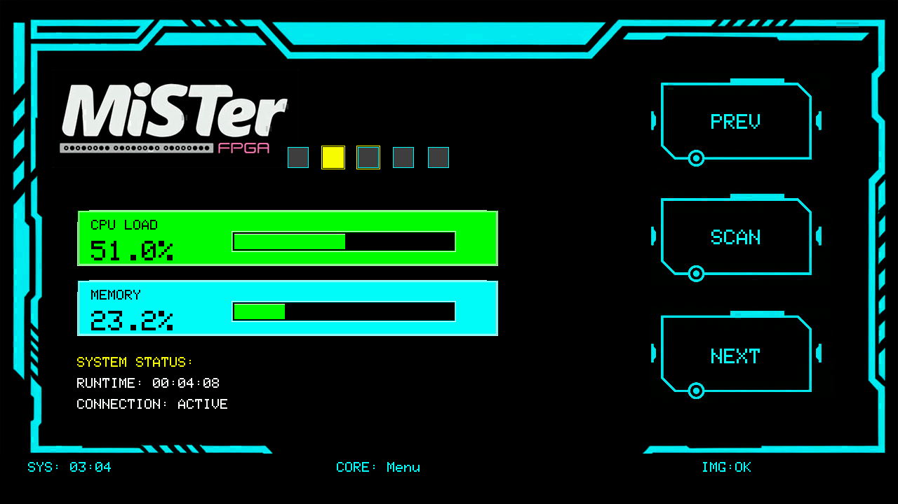

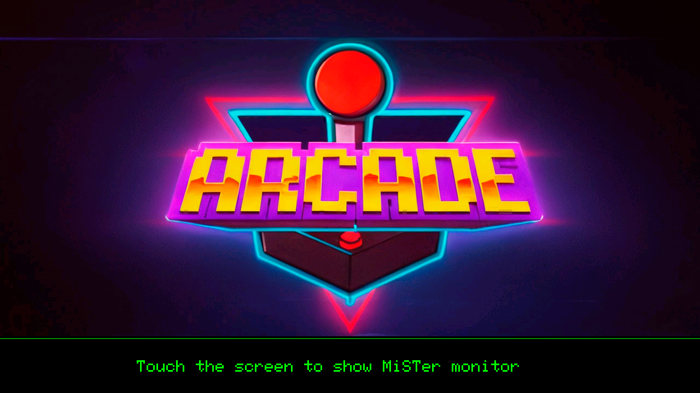
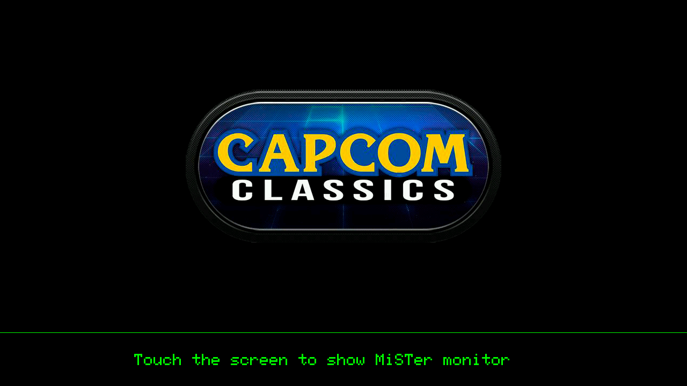

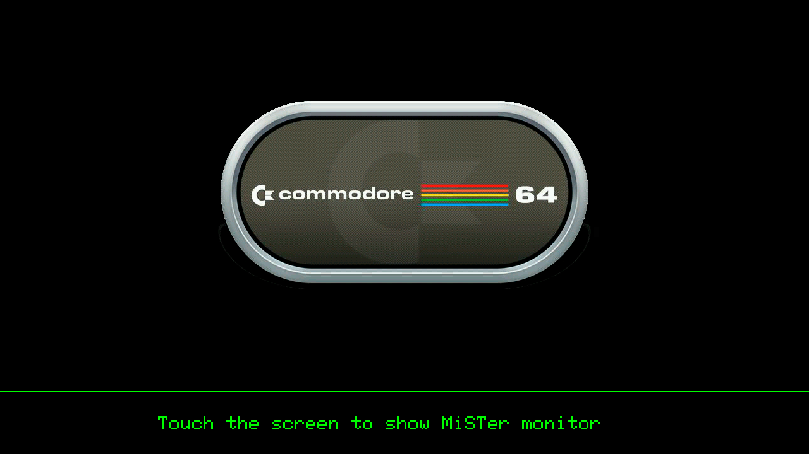
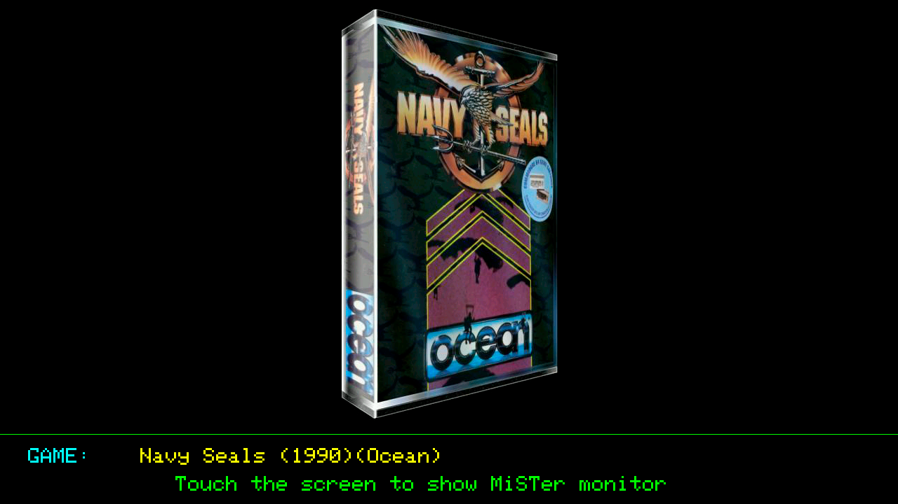

## 2,8" Cheap Yellow Display (CYD) Screenshots (320x240)

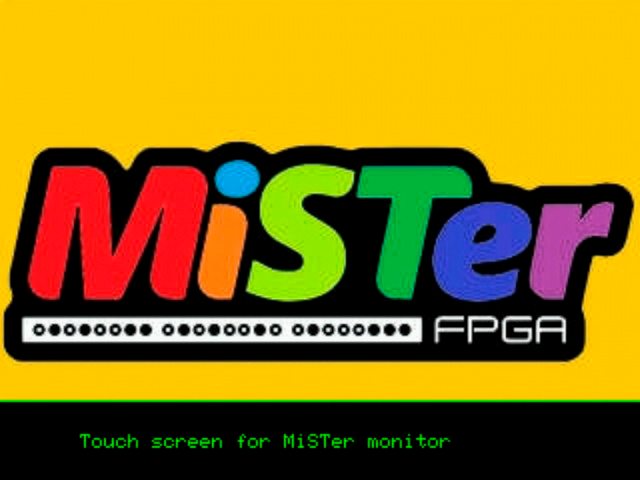
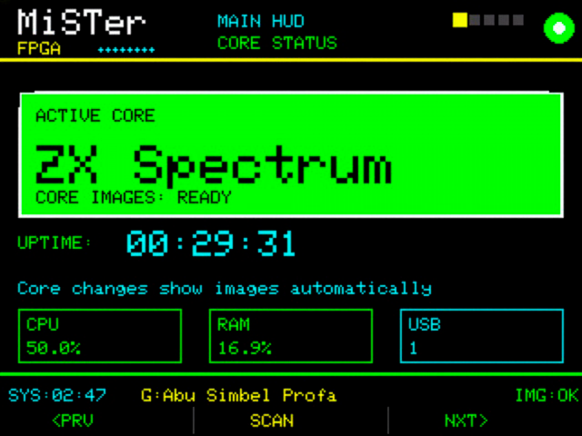
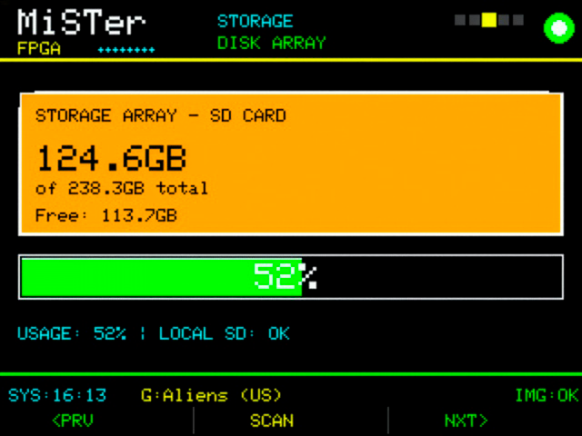
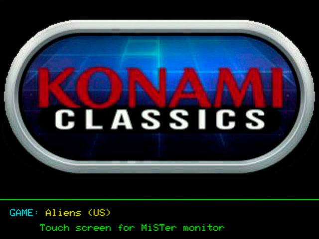
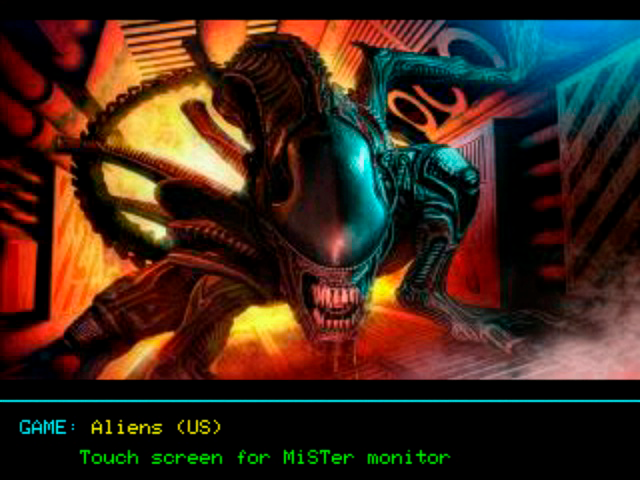
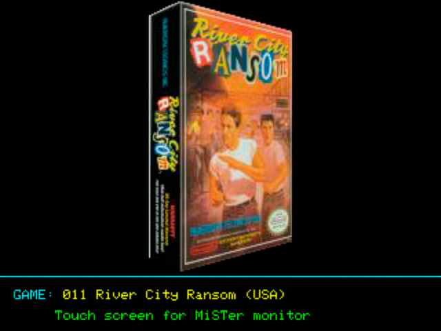
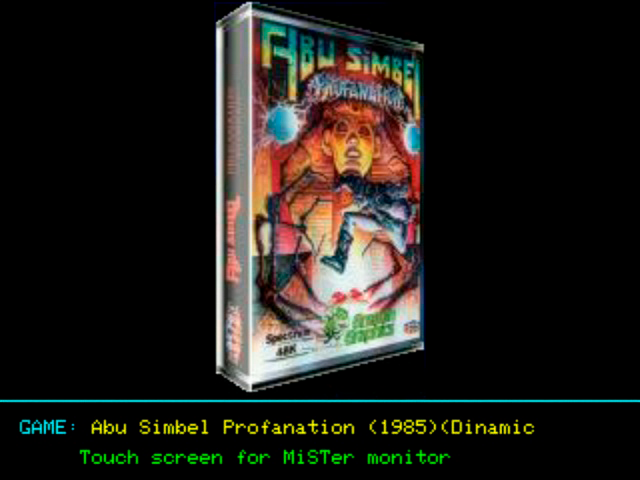

## To Do

### Hardware support

- ~**Cheap Yellow Display (CYD)** — Port to the widely available ESP32-2432S028R family.~
- **Guition 10.1" ESP32-P4 display** — Port to the Guition JC8012P4A1 family (ESP32-P4 + C6, 1280×800 MIPI-DSI capacitive touchscreen).
- **5" CYD variant** - Port to the ESP32-S3-8048S050C-I family (800x480 touchscreen).
- **M5Stack Core Basic support** — Port to the original Core Basic (ESP32, 320×240, physical buttons).
- **M5Stack Core S3 support** — Port to the Core S3 (ESP32-S3, 320×240 touchscreen).

### Data and content enrichment

- **RetroAchievements integration** — Show unlocked achievements and progress, building on [odelot/Main_MiSTer](https://github.com/odelot/Main_MiSTer).
- ~~**Enriched game metadata screen** — "Now Playing" view with synopsis, year, publisher, developer, genre.~~ *(shipped: Game Info panel)*
- **Game Manuals access** — Show manuals for the system or running game from the ⁠Game Manuals Databases by *Moondandy*.
- **Regional cover comparison** — Show EU/US/JP versions of the same game's artwork.
- **Multilanguage descriptions** — Info in the user's preferred language via ScreenScraper.

### AI-powered context layer

- **Historical curiosities** — AI-generated trivia about the loaded game, cached locally.
- **Retro conversation mode** — Activatable AI speech-to-text chat about the loaded game.

### Personal stats and history

- **Playtime tracking** — Hours per game and core, sessions, streaks, most played.
- **Internal achievements** — Device-specific achievements independent of RetroAchievements.

### Touch interaction and control

- **Favorite marking and MGL generation** — Mark the current game as favorite or create an MGL shortcut.
- **Visual core selector** — Touch grid of core and/or game artwork; tap to launch.

### Ambient and connected presence

- **Idle screensaver mode** — Cycle random covers with Ken Burns effect when MiSTer is at menu.
- **MiSTer screenshot reception** — Display native MiSTer screenshots as per-game galleries.
- **External launcher integration** — Show artwork on launches triggered by Zapparoo NFC tags or other web-based launchers.
- **Zapparoo launcher integration** — Show artwork on launches triggered by Zapparoo Launcher.
- **QR codes for expanded information** — On-screen QR linking to MobyGames database.

### Other

- Apply scaling for small images (rarely needed).

## License

MIT License — see LICENSE file for details.
